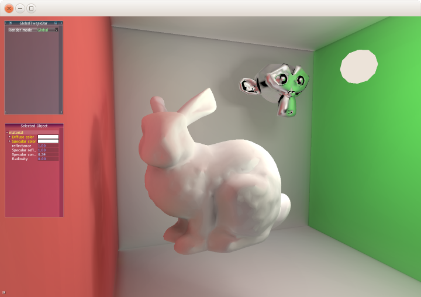
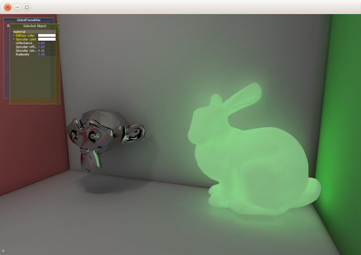

# Voxel Cone Tracing For Real Time Global Illumination
Converting mesh data to voxel data and rendering global illumination using cone tracing in OpenGL GLSL.
Based on the paper "Interactive Indirect Illumination Using Voxel Cone Tracing" by Cyril Crassin.

## Some Screenshots

